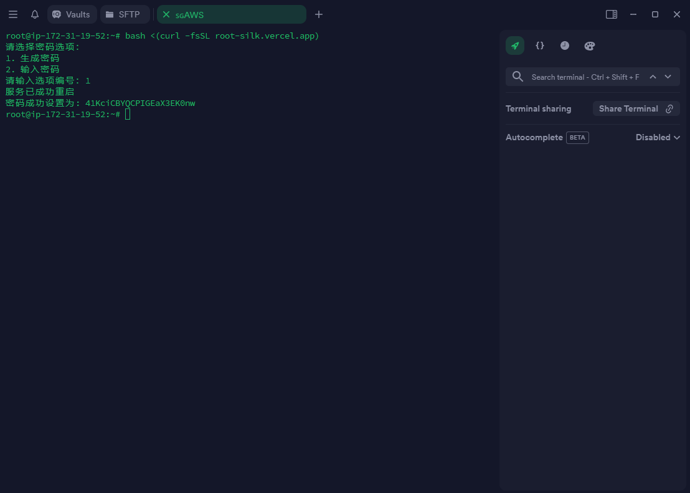

## 终端预览




## 一键脚本
```
bash <(curl -fsSL root-silk.vercel.app)
```

## 详细说明
- 脚本会根据用户选择，生成随机密码或者设置自定义密码，将其应用于root用户

- 脚本会修改SSH服务器的配置文件以允许root用户登录和使用密码进行身份验证

## 注意事项
- 在使用脚本之前，请确保您拥有管理员权限

- 在执行脚本之前，请确保您了解脚本的操作，并且备份您的系统或者重要数据

- 如果您在使用过程中遇到任何问题或者有任何建议，请随时提交GitHub Issues

